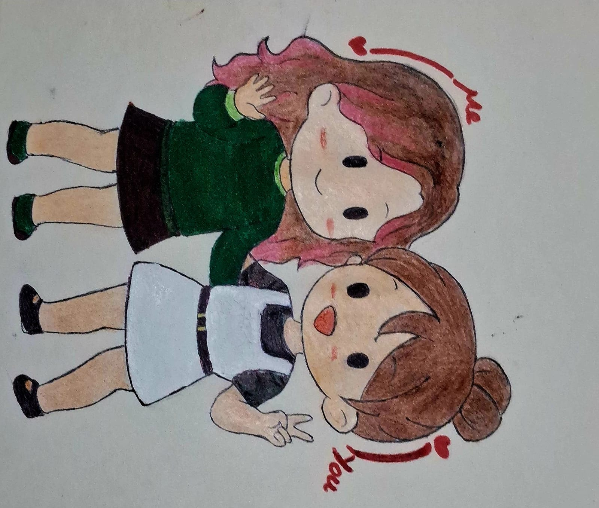

<html>
<head>
    <meta charset="UTF-8">
    <title>Birthday Package</title>

    <!-- Handwritten + Elegant Fonts -->
    <link href="https://fonts.googleapis.com/css2?family=Quicksand:wght@400;600&family=Dancing+Script:wght@600&family=Caveat:wght@400;700&display=swap" rel="stylesheet">

    
</head>

<body>

    

    

    

    

    

    

    

    

    

    

        <h1>✨ Happy Birthday Bestie ✨</h1>

        

            
Guess who's the eager one to be adultin' first huh?? tsk tsk  no more late night conversations huh? i mean i am still a minor hehe (*tucks hair behind ear cheekily*), OH WELL, to a new chapter with same ol' us, Comeback era.✨✨

        

        

            <h2>✨US✨</h2>
            
            
The only way we can have a picture together since you went ahead and decided to live on the Bloody pollution filled moon.

        

        

            <h2>Your Little Present✨✨</h2>
            <iframe 
    width="100%" 
    height="300" 
    scrolling="no" 
    frameborder="no" 
    allow="autoplay"
    src="https://w.soundcloud.com/player/?url=https%3A//api.soundcloud.com/playlists/soundcloud%3Aplaylists%3A2173296008%3Fsecret_token%3Ds-8QSYWhFA5dn&color=%238b7cff&auto_play=false&hide_related=true&show_comments=false&show_user=false&show_reposts=false&show_teaser=false&visual=true">
</iframe>

        

        

            
Well...i hope you liked it, to coming of age and adulting (*raises a glass*) and most of all to the prettiest, most gorgeous woman i know, Cheerss!!! (*clink*) 

        

    

    

</body>
</html>
